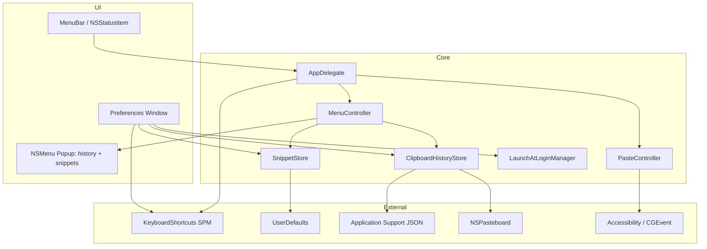

# Snippet Manager — Detailed Design

| Field | Value |
|-------|-------|
| Document version | 1.1 |
| App version | 1.0 (MARKETING_VERSION) |
| Last updated | 2026-07-02 |
| Target OS | macOS 14.0+ |

**Japanese:** [設計書.md](設計書.md)

---

## 1. Purpose & Scope

### 1.1 Purpose

Provide a menu-bar resident macOS app that invokes user-defined text snippets and **clipboard history** via **global hotkeys** and **auto-pastes** into the frontmost application.

### 1.2 In Scope

- Menu bar agent (`LSUIElement`)
- User-configurable global hotkeys (3 kinds)
- Numbered `NSMenu` snippet picker
- Clipboard history (Clipy-equivalent: monitoring, dedup, inline + folder chunking)
- Folder hierarchy with snippet CRUD
- Drag & drop move/reorder
- Launch at login
- UserDefaults / JSON file persistence

### 1.3 Out of Scope

- Image / RTF / file types in clipboard history (text only)
- Per-app history exclusion list
- iCloud / file sync
- Import/export
- Windows / iOS

---

## 2. System Architecture

### 2.1 Overview



### 2.2 Technology Stack

| Layer | Technology |
|-------|------------|
| UI | SwiftUI + AppKit (NSOutlineView, NSMenu) |
| Language | Swift 5 |
| Minimum OS | macOS 14.0 |
| Persistence | UserDefaults (JSON) + JSON file in Application Support (history) |
| Hotkeys | KeyboardShortcuts 3.0.1 |
| Login item | ServiceManagement.SMAppService |
| Clipboard monitoring | NSPasteboard.changeCount polling (0.75 s) |
| Paste | NSPasteboard + CGEvent |

### 2.3 Project Layout

See [SETUP.md](SETUP.md) for the full file list.

---

## 3. Functional Design

### 3.1 Agent Mode

| Setting | Value |
|---------|-------|
| `INFOPLIST_KEY_LSUIElement` | YES |
| `NSApp.setActivationPolicy` | `.accessory` |
| Dock icon | Hidden |
| Quit | Menu bar only (⌘Q) |

### 3.2 Global Hotkeys

Three Clipy-equivalent hotkeys (`KeyboardShortcuts.Name`):

| Identifier | Menu | Default |
|------------|------|---------|
| `showMainMenu` | Main (history + snippets) | `Cmd + Shift + V` |
| `showHistoryMenu` | History only | `Cmd + Control + V` |
| `showSnippetPicker` | Snippets only | `Cmd + Shift + B` |

- **Persistence:** KeyboardShortcuts → UserDefaults
- **UI:** `KeyboardShortcuts.Recorder` in Preferences → Shortcuts
- **Handler:** `KeyboardShortcuts.onKeyUp(for:)`
- **Migration:** if a legacy user explicitly recorded `Cmd+Shift+V` for `showSnippetPicker`, it is reset to its default at launch to avoid double-firing with `showMainMenu`

### 3.3 Snippet Menu

Built dynamically by `MenuController`.

```
Snippets            (disabled header)
├─ Folder A  ▶
│   ├─ 1. Title A   (key 1)
│   └─ 2. Title B   (key 2)
└─ Folder B  ▶
    └─ 3. Title C
```

| Spec | Value |
|------|-------|
| Position | `NSEvent.mouseLocation` |
| Numbering | `{n}. {title}` (global across folders) |
| Numeric keys | 1–9, 0 inside submenu |
| Tooltip | Snippet body |
| Title max | 50 chars + `…` |

### 3.3b Clipboard History (Clipy-equivalent)

`ClipboardHistoryStore` monitors and stores; `MenuController` renders menus.

**Monitoring:**

- Polls `NSPasteboard.general.changeCount` with a 0.75 s `Timer` (`.common` run-loop mode)
- Records plain text (`.string`) only; empty strings ignored
- Skips copies declaring `org.nspasteboard.ConcealedType` / `TransientType` / `AutoGeneratedType` (password managers etc.)
- Pasteboard content present at launch is not imported

**Retention:**

- Newest first; re-copying identical text moves the existing entry to the top (dedup)
- Entries beyond max history size (default 30, range 1–100) are dropped oldest-first

**Menu structure (main / history menus):**

```
History            (disabled header)
├─ 1. Most recent   (key 1)
├─ …
├─ 10. Tenth        (key 0)
├─ 11 - 20  ▶       (folder chunk)
└─ 21 - 30  ▶
```

| Spec | Value |
|------|-------|
| Inline items | Default 10 (0–20, configurable) |
| Items per folder | Default 10 (1–20, configurable) |
| Numbering | Continuous; numeric keys only for first 10 inline items |
| Title | First non-empty line, 50 chars max |
| Tooltip | Body (up to 500 chars) |
| Selection | Same auto-paste pipeline as snippets |

**Clear history:** status menu "履歴を消去" (with confirmation alert) or Preferences → History tab.

### 3.4 Auto-Paste Pipeline

`PasteController.paste` executes in order:

1. Write string to `NSPasteboard.general`
2. Activate previously frontmost app
3. Wait 0.1 seconds
4. Post `Cmd+V` via `CGEvent` (virtualKey 9, `.maskCommand`)

Requires Accessibility trust (`AXIsProcessTrusted()`).

### 3.5 Snippet Editor

| Component | Responsibility |
|-----------|----------------|
| `SnippetEditorView` | Toolbar, split layout, editor pane |
| `SnippetOutlineView` | NSOutlineView, selection, drag & drop |
| `SnippetStore` | CRUD, move, persist |

**Selection model:** `.folder(UUID)` | `.snippet(folderID, snippetID)`

**Drag & drop pasteboard:** `snippetUUID|sourceFolderUUID`

### 3.6 Preferences

Sidebar via `NavigationSplitView`:

| Tab | Content |
|-----|---------|
| General | Launch at login |
| Shortcuts | Hotkey recorders (main / history / snippets) |
| History | Max size, inline count, items per folder, clear history |
| Snippets | Embedded editor |

---

## 4. Data Model

### 4.1 Snippet

| Field | Type | Description |
|-------|------|-------------|
| id | UUID | Primary key |
| title | String | Display name |
| content | String | Pasted text |

### 4.2 SnippetFolder

| Field | Type | Description |
|-------|------|-------------|
| id | UUID | Primary key |
| title | String | Folder name |
| index | Int | Sort order |
| snippets | [Snippet] | Children |

### 4.3 ClipItem (clipboard history)

| Field | Type | Description |
|-------|------|-------------|
| id | UUID | Primary key |
| content | String | Copied text |
| copiedAt | Date | Copy timestamp |

### 4.4 Persistence

| Location | Content |
|-----|---------|
| UserDefaults `snippetFolders` | JSON array of folders |
| UserDefaults `snippets` | Legacy flat list (migrated on first load) |
| UserDefaults `clipboardMaxHistorySize` etc. | History settings (max / inline / per-folder counts) |
| `~/Library/Application Support/Snippet Manager/clipboard-history.json` | JSON array of ClipItem (atomic writes) |

History lives in a file (not UserDefaults) so large copied texts cannot bloat the preferences plist.

---

## 5. Non-Functional Requirements

| Topic | Detail |
|-------|--------|
| Sandbox | Disabled (CGEvent requirement) |
| Hardened Runtime | Enabled |
| Permissions | Accessibility; Input Monitoring if needed |
| Scale | Hundreds of snippets via UserDefaults |
| Privacy | History stored locally only; concealed pasteboard types never recorded |

---

## 6. Known Limitations

1. `CGEvent` paste uses US virtual key code 9 for `V`
2. No per-folder hotkeys
3. Numeric keys work **after** opening a folder submenu (inline history items respond at top level)
4. UserDefaults not suited for very large snippet datasets
5. Clipboard history is text-only (no images / RTF / files)
6. Pasting via this app also records the text into history (same as Clipy)

---

## 7. Revision History

| Ver | Date | Notes |
|-----|------|-------|
| 1.0 | 2026-07-01 | Initial release |
| 1.1 | 2026-07-02 | Added Clipy-equivalent clipboard history: 3 global hotkeys, History preferences tab, renamed `SnippetMenuController` to `MenuController` |

---

## Appendix: PDF Export

HTML version: [DESIGN.html](DESIGN.html)

Open in a browser and use **File → Export as PDF**.
