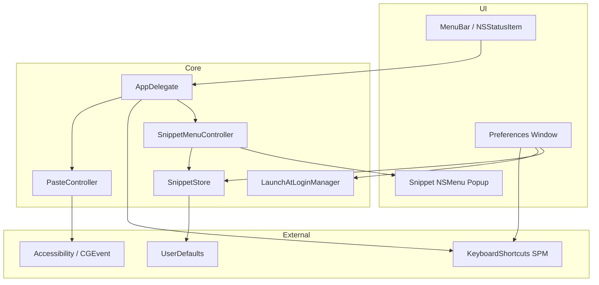
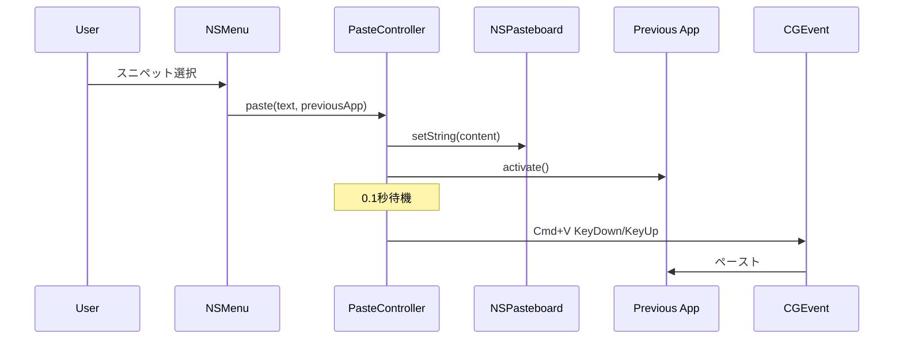
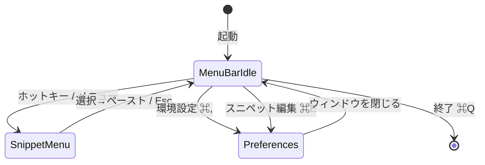

# Snippet Manager 詳細設計書

| 項目 | 内容 |
|------|------|
| ドキュメント版 | 1.0 |
| 対象バージョン | 1.0 (MARKETING_VERSION) |
| 最終更新 | 2026-07-01 |
| 対象 OS | macOS 14.0+ |

**English:** [DESIGN.md](DESIGN.md)

---

## 1. 目的とスコープ

### 1.1 目的

macOS 上で常駐し、ユーザー定義のテキストスニペットを **グローバルホットキー** から呼び出し、**任意のアプリへ自動ペースト** する。

### 1.2 スコープ内

- メニューバー常駐（LSUIElement）
- グローバルホットキー（ユーザー設定可能）
- 番号付き NSMenu スニペットピッカー
- フォルダ階層とスニペット CRUD
- ドラッグ＆ドロップによる移動・並べ替え
- ログイン時起動
- UserDefaults 永続化

### 1.3 スコープ外

- クリップボード履歴
- iCloud / ファイル同期
- スニペットのインポート/エクスポート
- Windows / iOS 版

---

## 2. システム構成

### 2.1 アーキテクチャ概要



### 2.2 技術スタック

| 層 | 技術 |
|----|------|
| UI | SwiftUI + AppKit（NSOutlineView, NSMenu, NSPanel 相当なし） |
| 言語 | Swift 5 |
| 最小 SDK | macOS 14.0 |
| 永続化 | UserDefaults（JSON） |
| ホットキー | KeyboardShortcuts 3.0.1 |
| ログイン項目 | ServiceManagement.SMAppService |
| ペースト | NSPasteboard + CGEvent |

### 2.3 プロジェクト構成

```
Snippet Manager/
├── Snippet Manager.xcodeproj
└── Snippet Manager/
    ├── Snippet_ManagerApp.swift      # @main, Settings シーン
    ├── AppDelegate.swift             # 常駐・メニューバー・ホットキー
    ├── SnippetStore.swift            # データ永続化
    ├── Snippet.swift / SnippetFolder.swift
    ├── SnippetMenuController.swift   # NSMenu 構築・ポップアップ
    ├── SnippetOutlineView.swift      # 編集用 NSOutlineView + D&D
    ├── SnippetEditorView.swift        # スニペット編集 UI
    ├── PreferencesView.swift         # 環境設定（3 タブ）
    ├── PreferencesWindowController.swift
    ├── PreferencesController.swift
    ├── PasteController.swift         # ペーストシーケンス
    ├── LaunchAtLoginManager.swift
    └── KeyboardShortcuts+Names.swift
```

---

## 3. 機能設計

### 3.1 常駐化

| 設定 | 値 |
|------|-----|
| `INFOPLIST_KEY_LSUIElement` | YES |
| `NSApp.setActivationPolicy` | `.accessory` |
| Dock 表示 | なし |
| 終了 | メニューバーからのみ（⌘Q） |

### 3.2 グローバルホットキー

- **識別子:** `showSnippetPicker`（`KeyboardShortcuts.Name`）
- **デフォルト:** `Cmd + Shift + V`（keyCode 9, modifiers command+shift）
- **永続化:** KeyboardShortcuts ライブラリが UserDefaults へ自動保存
- **UI:** `KeyboardShortcuts.Recorder`（環境設定 → ショートカット）
- **コールバック:** `KeyboardShortcuts.onKeyUp(for: .showSnippetPicker)`

### 3.3 スニペットメニュー

`SnippetMenuController` が `NSMenu` を動的構築する。

**構造:**

```
スニペット          （無効ヘッダー）
├─ フォルダA  ▶
│   ├─ 1. タイトルA   (keyEquivalent: 1)
│   └─ 2. タイトルB   (keyEquivalent: 2)
└─ フォルダB  ▶
    └─ 3. タイトルC
```

| 仕様 | 値 |
|------|-----|
| 表示位置 | `NSEvent.mouseLocation` |
| 番号表記 | `{listNumber}. {title}`（フォルダ横断で連番） |
| 数値キー | サブメニュー内 1–9, 0（10 件目） |
| ツールチップ | スニペット本文 |
| アイコン | folder / doc.plaintext（テンプレート） |
| タイトル最大長 | 50 文字（超過時 `…`） |

### 3.4 自動ペースト処理

`PasteController.paste` が以下を **順序どおり** 実行する。



| ステップ | 処理 |
|---------|------|
| ① | `NSPasteboard.general` に文字列書き込み |
| ② | 記憶済み前面アプリを `activate` |
| ③ | `DispatchQueue.main.asyncAfter(0.1s)` |
| ④ | `CGEvent` virtualKey 9 + `.maskCommand` で KeyDown/Up |

**前提:** `AXIsProcessTrusted()` が true（アクセシビリティ許可）

### 3.5 スニペット編集

| コンポーネント | 責務 |
|---------------|------|
| `SnippetEditorView` | ツールバー・分割レイアウト・編集ペイン |
| `SnippetOutlineView` | NSOutlineView、選択、D&D |
| `SnippetStore` | CRUD・移動・永続化 |

**選択モデル (`EditorSelection`):**

- `.folder(UUID)` — フォルダ名編集
- `.snippet(folderID, snippetID)` — タイトル・本文編集

**ドラッグ＆ドロップ:**

- Pasteboard 型: `jp.co.crowdcloud.Snippet-Manager.snippet-drag`
- ペイロード: `{snippetUUID}|{sourceFolderUUID}`
- ドロップ先: フォルダ行（末尾追加）またはスニペット行間（挿入位置）

### 3.6 環境設定

`NavigationSplitView` によるサイドバー UI。

| タブ | 内容 |
|------|------|
| 一般 | ログイン時起動（`LaunchAtLoginManager`） |
| ショートカット | グローバルホットキー Recorder |
| スニペット | `SnippetEditorView` 埋め込み |

---

## 4. データ設計

### 4.1 エンティティ

#### Snippet

| フィールド | 型 | 説明 |
|-----------|-----|------|
| id | UUID | 主キー |
| title | String | 一覧・メニュー表示名 |
| content | String | ペーストされる本文 |

#### SnippetFolder

| フィールド | 型 | 説明 |
|-----------|-----|------|
| id | UUID | 主キー |
| title | String | フォルダ名 |
| index | Int | 表示順 |
| snippets | [Snippet] | 子スニペット |

### 4.2 永続化

| キー | 内容 |
|------|------|
| `snippetFolders` | `[SnippetFolder]` の JSON（`JSONEncoder`） |
| `snippets` | レガシー（フラット配列）— 初回マイグレーション時のみ読込 |

**マイグレーション:** レガシー `snippets` が存在する場合、単一フォルダ「スニペット」に包んで `snippetFolders` へ移行。

### 4.3 初期データ

初回起動時、フォルダ「スニペット」にダミー 3 件:

1. 挨拶
2. メール署名
3. コード雛形

---

## 5. 非機能要件

### 5.1 セキュリティ

| 項目 | 設定 |
|------|------|
| App Sandbox | OFF（CGEvent ペーストに必要） |
| Hardened Runtime | ON |
| 必要権限 | アクセシビリティ、（場合により）入力監視 |

### 5.2 パフォーマンス

- スニペット数数百件程度を想定（UserDefaults 同期 I/O）
- メニュー再構築は `SnippetStore.$folders` 変更時のみ

### 5.3 ローカライズ

- UI 文言: 日本語（ハードコード）
- 将来: String Catalog への移行余地あり（`STRING_CATALOG_GENERATE_SYMBOLS = YES`）

---

## 6. 画面遷移



---

## 7. 既知の制限

1. CGEvent による ⌘V は US キーボードレイアウトの仮想キーコード 9 を使用
2. クリップボード履歴・フォルダ個別ホットキーは未実装
3. スニペットメニューの数値キーは **サブメニューを開いた後** に有効
4. UserDefaults のため大量データには不向き

---

## 8. 変更履歴

| 版 | 日付 | 内容 |
|----|------|------|
| 1.0 | 2026-07-01 | 初版作成 |

---

## 付録: PDF 出力

HTML 版: [設計書.html](設計書.html)

ブラウザで開き **ファイル → PDFとして書き出す** で PDF を生成できます。
