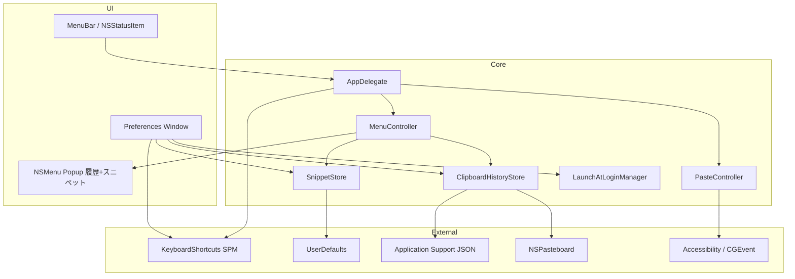
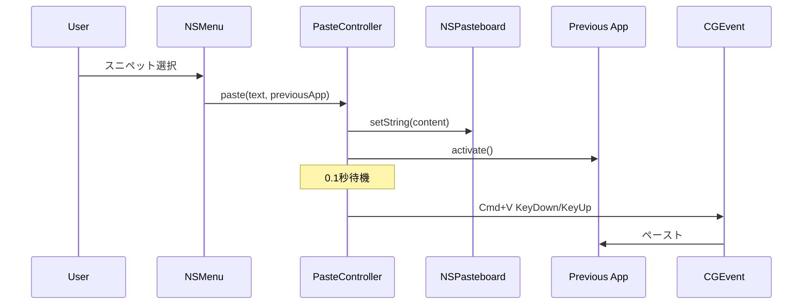
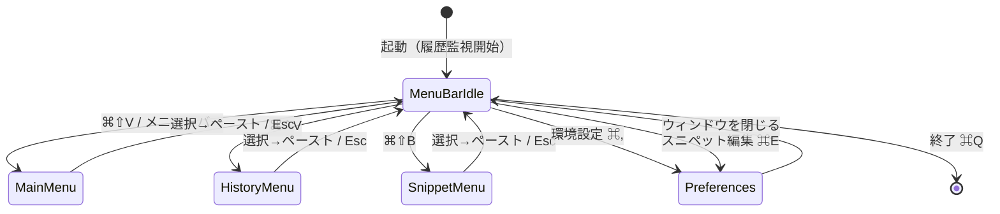

# Snippet Manager 詳細設計書

| 項目 | 内容 |
|------|------|
| ドキュメント版 | 1.1 |
| 対象バージョン | 1.0 (MARKETING_VERSION) |
| 最終更新 | 2026-07-02 |
| 対象 OS | macOS 14.0+ |

**English:** [DESIGN.md](DESIGN.md)

---

## 1. 目的とスコープ

### 1.1 目的

macOS 上で常駐し、ユーザー定義のテキストスニペットと **クリップボード履歴** を **グローバルホットキー** から呼び出し、**任意のアプリへ自動ペースト** する。

### 1.2 スコープ内

- メニューバー常駐（LSUIElement）
- グローバルホットキー（ユーザー設定可能・3 系統）
- 番号付き NSMenu スニペットピッカー
- クリップボード履歴（Clipy 同等: 監視・重複排除・インライン + フォルダ分割表示）
- フォルダ階層とスニペット CRUD
- ドラッグ＆ドロップによる移動・並べ替え
- ログイン時起動
- UserDefaults / JSON ファイル永続化

### 1.3 スコープ外

- クリップボード履歴の画像・RTF・ファイル形式対応（テキストのみ）
- アプリ別の履歴除外リスト
- iCloud / ファイル同期
- スニペットのインポート/エクスポート
- Windows / iOS 版

---

## 2. システム構成

### 2.1 アーキテクチャ概要



### 2.2 技術スタック

| 層 | 技術 |
|----|------|
| UI | SwiftUI + AppKit（NSOutlineView, NSMenu, NSPanel 相当なし） |
| 言語 | Swift 5 |
| 最小 SDK | macOS 14.0 |
| 永続化 | UserDefaults（JSON）+ Application Support 配下の JSON ファイル（履歴） |
| ホットキー | KeyboardShortcuts 3.0.1 |
| ログイン項目 | ServiceManagement.SMAppService |
| クリップボード監視 | NSPasteboard.changeCount ポーリング（0.75 秒） |
| ペースト | NSPasteboard + CGEvent |

### 2.3 プロジェクト構成

```
Snippet Manager/
├── Snippet Manager.xcodeproj
└── Snippet Manager/
    ├── Snippet_ManagerApp.swift      # @main, Settings シーン
    ├── AppDelegate.swift             # 常駐・メニューバー・ホットキー
    ├── SnippetStore.swift            # スニペット永続化
    ├── Snippet.swift / SnippetFolder.swift
    ├── ClipItem.swift                # 履歴 1 件のモデル
    ├── ClipboardHistoryStore.swift   # 履歴の監視・保持・永続化
    ├── MenuController.swift          # NSMenu 構築（履歴 + スニペット）・ポップアップ
    ├── SnippetOutlineView.swift      # 編集用 NSOutlineView + D&D
    ├── SnippetEditorView.swift        # スニペット編集 UI
    ├── PreferencesView.swift         # 環境設定（4 タブ）
    ├── PreferencesWindowController.swift
    ├── PreferencesController.swift
    ├── PasteController.swift         # ペーストシーケンス
    ├── LaunchAtLoginManager.swift
    └── KeyboardShortcuts+Names.swift
```

---

## 3. 機能設計

### 3.1 常駐化

| 設定 | 値 |
|------|-----|
| `INFOPLIST_KEY_LSUIElement` | YES |
| `NSApp.setActivationPolicy` | `.accessory` |
| Dock 表示 | なし |
| 終了 | メニューバーからのみ（⌘Q） |

### 3.2 グローバルホットキー

Clipy と同等の 3 系統（`KeyboardShortcuts.Name`）。

| 識別子 | 内容 | デフォルト |
|--------|------|-----------|
| `showMainMenu` | メイン（履歴 + スニペット） | `Cmd + Shift + V` |
| `showHistoryMenu` | 履歴のみ | `Cmd + Control + V` |
| `showSnippetPicker` | スニペットのみ | `Cmd + Shift + B` |

- **永続化:** KeyboardShortcuts ライブラリが UserDefaults へ自動保存
- **UI:** `KeyboardShortcuts.Recorder`（環境設定 → ショートカット）
- **コールバック:** `KeyboardShortcuts.onKeyUp(for:)`
- **マイグレーション:** 旧版で `showSnippetPicker` に `Cmd+Shift+V` を明示登録済みの場合、`showMainMenu` のデフォルトと二重発火するため起動時にスニペット側をデフォルトへリセット

### 3.3 スニペットメニュー

`MenuController` が `NSMenu` を動的構築する。

**構造:**

```
スニペット          （無効ヘッダー）
├─ フォルダA  ▶
│   ├─ 1. タイトルA   (keyEquivalent: 1)
│   └─ 2. タイトルB   (keyEquivalent: 2)
└─ フォルダB  ▶
    └─ 3. タイトルC
```

| 仕様 | 値 |
|------|-----|
| 表示位置 | `NSEvent.mouseLocation` |
| 番号表記 | `{listNumber}. {title}`（フォルダ横断で連番） |
| 数値キー | サブメニュー内 1–9, 0（10 件目） |
| ツールチップ | スニペット本文 |
| アイコン | folder / doc.plaintext（テンプレート） |
| タイトル最大長 | 50 文字（超過時 `…`） |

### 3.3b クリップボード履歴（Clipy 同等）

`ClipboardHistoryStore` が監視・保持を担い、`MenuController` がメニューへ展開する。

**監視:**

- `NSPasteboard.general.changeCount` を **0.75 秒間隔** の `Timer`（`.common` モード）でポーリング
- テキスト（`.string`）のみ記録。空文字は無視
- `org.nspasteboard.ConcealedType` / `TransientType` / `AutoGeneratedType` を宣言するコピー（パスワードマネージャ等）は記録しない
- 起動時点のペーストボード内容は取り込まない

**保持:**

- 新しい順に保持。同一内容の再コピーは既存エントリを先頭へ移動（重複排除）
- 最大保存件数（デフォルト 30、範囲 1–100）を超えた分は古い順に破棄

**メニュー構造（メイン / 履歴メニュー共通）:**

```
履歴               （無効ヘッダー）
├─ 1. 直近のコピー   (keyEquivalent: 1)
├─ …
├─ 10. 10件目       (keyEquivalent: 0)
├─ 11 - 20  ▶       （フォルダ分割）
└─ 21 - 30  ▶
```

| 仕様 | 値 |
|------|-----|
| インライン表示件数 | デフォルト 10（0–20、環境設定で変更可） |
| フォルダあたりの件数 | デフォルト 10（1–20、環境設定で変更可） |
| 番号表記 | 全体で連番。数値キーはインライン先頭 10 件のみ |
| タイトル | 最初の非空行を 50 文字まで表示 |
| ツールチップ | 本文（500 文字まで） |
| 選択時 | スニペットと同じ自動ペーストパイプライン |

**履歴の消去:** ステータスメニュー「履歴を消去」（確認アラート付き）、または環境設定 → 履歴タブ。

### 3.4 自動ペースト処理

`PasteController.paste` が以下を **順序どおり** 実行する。



| ステップ | 処理 |
|---------|------|
| ① | `NSPasteboard.general` に文字列書き込み |
| ② | 記憶済み前面アプリを `activate` |
| ③ | `DispatchQueue.main.asyncAfter(0.1s)` |
| ④ | `CGEvent` virtualKey 9 + `.maskCommand` で KeyDown/Up |

**前提:** `AXIsProcessTrusted()` が true（アクセシビリティ許可）

### 3.5 スニペット編集

| コンポーネント | 責務 |
|---------------|------|
| `SnippetEditorView` | ツールバー・分割レイアウト・編集ペイン |
| `SnippetOutlineView` | NSOutlineView、選択、D&D |
| `SnippetStore` | CRUD・移動・永続化 |

**選択モデル (`EditorSelection`):**

- `.folder(UUID)` — フォルダ名編集
- `.snippet(folderID, snippetID)` — タイトル・本文編集

**ドラッグ＆ドロップ:**

- Pasteboard 型: `jp.co.crowdcloud.Snippet-Manager.snippet-drag`
- ペイロード: `{snippetUUID}|{sourceFolderUUID}`
- ドロップ先: フォルダ行（末尾追加）またはスニペット行間（挿入位置）

### 3.6 環境設定

`NavigationSplitView` によるサイドバー UI。

| タブ | 内容 |
|------|------|
| 一般 | ログイン時起動（`LaunchAtLoginManager`） |
| ショートカット | グローバルホットキー Recorder（メイン・履歴・スニペットの 3 系統） |
| 履歴 | 最大保存件数・インライン表示件数・フォルダあたりの件数・履歴の消去 |
| スニペット | `SnippetEditorView` 埋め込み |

---

## 4. データ設計

### 4.1 エンティティ

#### Snippet

| フィールド | 型 | 説明 |
|-----------|-----|------|
| id | UUID | 主キー |
| title | String | 一覧・メニュー表示名 |
| content | String | ペーストされる本文 |

#### SnippetFolder

| フィールド | 型 | 説明 |
|-----------|-----|------|
| id | UUID | 主キー |
| title | String | フォルダ名 |
| index | Int | 表示順 |
| snippets | [Snippet] | 子スニペット |

#### ClipItem（クリップボード履歴）

| フィールド | 型 | 説明 |
|-----------|-----|------|
| id | UUID | 主キー |
| content | String | コピーされたテキスト |
| copiedAt | Date | コピー日時 |

### 4.2 永続化

| 保存先 | 内容 |
|------|------|
| UserDefaults `snippetFolders` | `[SnippetFolder]` の JSON（`JSONEncoder`） |
| UserDefaults `snippets` | レガシー（フラット配列）— 初回マイグレーション時のみ読込 |
| UserDefaults `clipboardMaxHistorySize` ほか | 履歴設定（最大件数・インライン件数・フォルダ件数） |
| `~/Library/Application Support/Snippet Manager/clipboard-history.json` | `[ClipItem]` の JSON（アトミック書き込み） |

**マイグレーション:** レガシー `snippets` が存在する場合、単一フォルダ「スニペット」に包んで `snippetFolders` へ移行。

**履歴を UserDefaults に置かない理由:** 巨大テキストのコピーで plist が肥大化するのを避けるため、履歴のみファイル永続化とする。

### 4.3 初期データ

初回起動時、フォルダ「スニペット」にダミー 3 件:

1. 挨拶
2. メール署名
3. コード雛形

---

## 5. 非機能要件

### 5.1 セキュリティ

| 項目 | 設定 |
|------|------|
| App Sandbox | OFF（CGEvent ペーストに必要） |
| Hardened Runtime | ON |
| 必要権限 | アクセシビリティ、（場合により）入力監視 |

### 5.2 パフォーマンス

- スニペット数数百件程度を想定（UserDefaults 同期 I/O）
- メニュー再構築は `SnippetStore.$folders` / `ClipboardHistoryStore.$items` / 履歴表示設定の変更時のみ
- 履歴ポーリングは changeCount 比較のみ（変化がなければ何もしない）

### 5.4 プライバシー

- 履歴はローカルの JSON ファイルのみに保存（外部送信なし）
- `org.nspasteboard.ConcealedType` 等を宣言する秘匿コピーは記録しない

### 5.3 ローカライズ

- UI 文言: 日本語（ハードコード）
- 将来: String Catalog への移行余地あり（`STRING_CATALOG_GENERATE_SYMBOLS = YES`）

---

## 6. 画面遷移



---

## 7. 既知の制限

1. CGEvent による ⌘V は US キーボードレイアウトの仮想キーコード 9 を使用
2. フォルダ個別ホットキーは未実装
3. メニューの数値キーは **サブメニューを開いた後** に有効（履歴インライン分はメニュー直下で有効）
4. UserDefaults のため大量スニペットには不向き
5. クリップボード履歴はテキストのみ（画像・RTF・ファイルは対象外）
6. 自アプリからのペースト時も履歴に記録される（Clipy と同挙動）

---

## 8. 変更履歴

| 版 | 日付 | 内容 |
|----|------|------|
| 1.0 | 2026-07-01 | 初版作成 |
| 1.1 | 2026-07-02 | クリップボード履歴機能（Clipy 同等）を追加。ホットキー 3 系統化、環境設定に履歴タブ追加、`SnippetMenuController` を `MenuController` へ改名 |

---

## 付録: PDF 出力

HTML 版: [設計書.html](設計書.html)

ブラウザで開き **ファイル → PDFとして書き出す** で PDF を生成できます。
